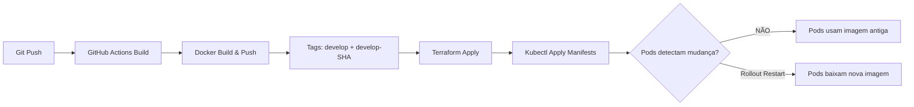

# Kubernetes Image Update Strategy

## Problema: Kubernetes Não Detecta Novas Imagens Automaticamente

### Por que isso acontece?

Quando você usa a **mesma tag** (ex: `develop`, `latest`) para diferentes versões de uma imagem Docker:

1. ✅ **Docker Hub recebe a nova imagem** com a tag `develop`
2. ❌ **Kubernetes NÃO sabe que a imagem mudou** porque a tag permanece igual
3. ❌ **imagePullPolicy: Always** só funciona quando um **NOVO pod** é criado, mas não força a criação automática de novos pods

**Resultado:** Os pods continuam usando a imagem antiga até que você force um rollout manual.

### Fluxo Atual



## Solução Implementada: Rollout Automático no CI/CD

### Como Funciona

Adicionamos um step no CI/CD que **força o rollout** de todos os deployments após o Terraform apply:

```yaml
# .github/workflows/develop.yml
rollout-deployments:
  name: Rollout deployments (dev)
  needs: terraform-apply
  runs-on: ubuntu-latest
  steps:
    - name: Configure AWS credentials
      uses: aws-actions/configure-aws-credentials@v5.0.0

    - name: Update kubeconfig
      run: aws eks update-kubeconfig --name eks-fiap-oficina-mecanica --region us-east-2

    - name: Rollout all services
      run: |
        kubectl -n oficina-mecanica-dev rollout restart deployment/eureka-server
        kubectl -n oficina-mecanica-dev rollout restart deployment/auth-service
        # ... outros services

        kubectl -n oficina-mecanica-dev rollout status deployment/eureka-server --timeout=5m
        # ... aguarda todos ficarem prontos
```

### Vantagens

✅ **Simples de implementar** - apenas alguns comandos kubectl
✅ **Funciona imediatamente** - sem mudanças na infraestrutura
✅ **Zero downtime** - rollout gradual com health checks
✅ **Garante atualização** - força pull da imagem mais recente

### Desvantagens

❌ Faz rollout de **todos** os services, mesmo os que não mudaram
❌ Aumenta o tempo do pipeline (aguarda todos os rollouts)
❌ Não é a solução "ideal" arquiteturalmente

## Solução Alternativa: Tags Dinâmicas com Kustomize

### Como Funciona

Use tags **únicas** para cada build e atualize os manifestos Kubernetes dinamicamente:

```yaml
# CI/CD já gera: develop-${SHORT_SHA}
images:
  - name: grecomilani/auth-service
    newTag: develop-a1b2c3d  # SHA único por commit
```

### Implementação

**Opção A: Kustomize setImage no CI/CD**

```bash
cd k8s/overlays/dev
kustomize edit set image grecomilani/auth-service:develop-${SHORT_SHA}
kubectl apply -k .
```

**Opção B: Terraform com variável de tag**

```hcl
# infra/variables.tf
variable "image_tag" {
  description = "Docker image tag to deploy"
  type        = string
  default     = "develop"
}

# infra/k8s.tf
locals {
  kustomize_path = terraform.workspace == "dev"
    ? "../k8s/overlays/dev"
    : "../k8s/overlays/prod"

  # Gera kustomization.yaml com tag dinâmica
  kustomize_with_tag = templatefile("${path.module}/kustomize-template.yaml", {
    image_tag = var.image_tag
  })
}
```

**Opção C: ArgoCD Image Updater** (recomendado para produção)

```yaml
# Monitora Docker Hub e atualiza automaticamente
apiVersion: argoproj.io/v1alpha1
kind: Application
metadata:
  annotations:
    argocd-image-updater.argoproj.io/image-list: auth=grecomilani/auth-service
    argocd-image-updater.argoproj.io/auth.update-strategy: digest
```

### Vantagens

✅ **Rollout seletivo** - apenas services modificados
✅ **Mais eficiente** - menos tempo de deploy
✅ **Rastreabilidade** - cada deployment tem SHA único
✅ **GitOps ready** - compatível com ArgoCD/Flux

### Desvantagens

❌ Requer mudanças na infraestrutura
❌ Mais complexo de implementar
❌ Pode exigir ferramentas adicionais (ArgoCD, Flux)

## Comparação das Abordagens

| Aspecto | Rollout Automático | Tags Dinâmicas | ArgoCD/Flux |
|---------|-------------------|----------------|-------------|
| Complexidade | 🟢 Baixa | 🟡 Média | 🔴 Alta |
| Tempo de impl. | 🟢 < 1h | 🟡 2-4h | 🔴 1-2 dias |
| Eficiência | 🟡 Média | 🟢 Alta | 🟢 Alta |
| Rastreabilidade | 🟡 Média | 🟢 Alta | 🟢 Alta |
| Zero Downtime | 🟢 Sim | 🟢 Sim | 🟢 Sim |
| Rollout Seletivo | 🔴 Não | 🟢 Sim | 🟢 Sim |
| Manutenção | 🟢 Baixa | 🟡 Média | 🟡 Média |

## Recomendações

### Para Agora (Implementado)

✅ **Use Rollout Automático** - já está funcionando nos workflows `develop.yml` e `main.yml`

### Para o Futuro

📋 **Migrar para Tags Dinâmicas** quando:
- O time crescer e precisar de deployments mais rápidos
- Quiser rastreabilidade completa (qual SHA está em cada ambiente)
- Precisar de rollout seletivo (apenas services modificados)

📋 **Considerar ArgoCD/Flux** quando:
- Adotar GitOps como padrão
- Precisar de reconciliação automática
- Quiser UI para gerenciar deployments
- Ter múltiplos ambientes/clusters

## Troubleshooting

### Problema: Pods não atualizam após CI/CD

**Sintoma:** Pipeline passa, mas pods continuam com imagem antiga

**Solução:**
```bash
# Verificar se rollout-deployments rodou
# No GitHub Actions, verificar logs do job "Rollout deployments"

# Rollout manual (se necessário)
kubectl -n oficina-mecanica-dev rollout restart deployment/<service-name>
kubectl -n oficina-mecanica-dev rollout status deployment/<service-name>
```

### Problema: Rollout demora muito

**Sintoma:** Job "Rollout deployments" excede timeout

**Causas possíveis:**
- Startup probes muito longos
- Recursos insuficientes no cluster
- Database connection issues

**Solução:**
```bash
# Verificar events dos pods
kubectl -n oficina-mecanica-dev describe pod <pod-name>

# Verificar logs
kubectl -n oficina-mecanica-dev logs <pod-name>

# Aumentar timeout no workflow (se necessário)
--timeout=10m  # default é 5m
```

### Problema: ImagePullBackOff

**Sintoma:** Pods ficam em ImagePullBackOff após rollout

**Causas:**
- Imagem não existe no Docker Hub
- Tag incorreta
- Rate limit do Docker Hub

**Solução:**
```bash
# Verificar se imagem existe
docker pull grecomilani/auth-service:develop

# Verificar events
kubectl -n oficina-mecanica-dev describe pod <pod-name>

# Verificar imagePullPolicy
kubectl -n oficina-mecanica-dev get deployment auth-service -o yaml | grep imagePullPolicy
```

## Referências

- [Kubernetes Image Pull Policy](https://kubernetes.io/docs/concepts/containers/images/#image-pull-policy)
- [Kubectl Rollout](https://kubernetes.io/docs/reference/kubectl/generated/kubectl_rollout/)
- [Kustomize Images](https://kubectl.docs.kubernetes.io/references/kustomize/kustomization/images/)
- [ArgoCD Image Updater](https://argocd-image-updater.readthedocs.io/)
