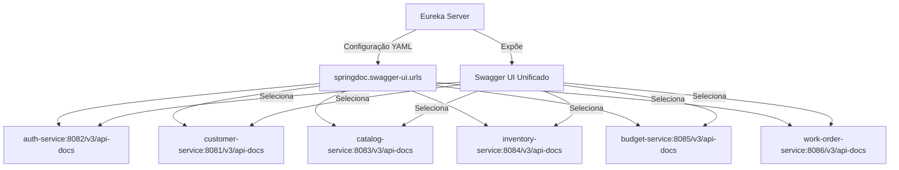

# Swagger Unificado - Documentação Agregada

## Visão Geral

Todos os microservices da Oficina possuem suas próprias documentações OpenAPI/Swagger. Para facilitar o uso, implementamos um **Swagger Agregador** no Eureka Server que unifica todas as documentações em uma única interface com dropdown de seleção.

## Como Funciona



### Fluxo

1. **Eureka Server** carrega configuração de URLs dos microservices do `application.yml`
2. **SpringDoc** detecta a lista de URLs e gera dropdown no Swagger UI
3. **Swagger UI** mostra um **dropdown "Select a definition"** com todos os services configurados
4. **Usuário** seleciona o service desejado no dropdown
5. **Swagger UI** busca a documentação OpenAPI do service selecionado (`/v3/api-docs`)
6. **Service** responde com sua especificação OpenAPI
7. **Swagger UI** renderiza a documentação do service

## Vantagens

✅ **Interface única** - Um único Swagger UI para todos os services
✅ **Funciona em todos os ambientes** - Local, Docker, Kubernetes
✅ **Fácil de usar** - Dropdown para selecionar o service
✅ **Configuração simples** - URLs definidas em YAML por ambiente
✅ **Sem conflitos** - Usa configuração nativa do SpringDoc

## Arquitetura da Implementação

A implementação atual é **simplificada e baseada em configuração estática** no YAML. Não usa código Java customizado para evitar conflitos com os endpoints padrão do SpringDoc.

### Arquivos de Configuração por Ambiente

Cada ambiente tem sua própria configuração de URLs:

#### 1. application.yml (Base - Kubernetes)
**Localização:** `eureka-server/src/main/resources/application.yml`

Usa **service names** do Kubernetes (DNS interno):

```yaml
springdoc:
  swagger-ui:
    urls:
      - name: Auth Service
        url: http://auth-service:8082/v3/api-docs
      - name: Customer Service
        url: http://customer-service:8081/v3/api-docs
      - name: Catalog Service
        url: http://catalog-service:8083/v3/api-docs
      - name: Inventory Service
        url: http://inventory-service:8084/v3/api-docs
      - name: Budget Service
        url: http://budget-service:8085/v3/api-docs
      - name: Work Order Service
        url: http://work-order-service:8086/v3/api-docs
    path: /swagger-ui.html
    display-request-duration: true
    filter: true
  show-actuator: false
```

#### 2. application-docker.yml (Docker Compose)
**Localização:** `eureka-server/src/main/resources/application-docker.yml`

Usa **localhost** porque todas as portas estão mapeadas no host:

```yaml
springdoc:
  swagger-ui:
    urls:
      - name: Auth Service
        url: http://localhost:8082/v3/api-docs
      - name: Customer Service
        url: http://localhost:8081/v3/api-docs
      # ... etc
```

#### 3. application-k8s.yml (Kubernetes)
**Localização:** `eureka-server/src/main/resources/application-k8s.yml`

Usa **service names** do Kubernetes com `config-url` explícito:

```yaml
springdoc:
  swagger-ui:
    urls:
      - name: Auth Service
        url: http://auth-service:8082/v3/api-docs
      # ... etc
    path: /swagger-ui.html
    config-url: /v3/api-docs/swagger-config
```

### Services Incluídos

| Service | Porta | SpringDoc | Incluído no Agregador |
|---------|-------|-----------|----------------------|
| auth-service | 8082 | ✅ | ✅ |
| customer-service | 8081 | ✅ | ✅ |
| catalog-service | 8083 | ✅ | ✅ |
| inventory-service | 8084 | ✅ | ✅ |
| budget-service | 8085 | ✅ | ✅ |
| work-order-service | 8086 | ✅ | ✅ |
| notification-service | 8087 | ❌ | ❌ |

**Nota:** `notification-service` **não está incluído** porque:
- É um serviço baseado em eventos (event-driven)
- Não expõe API REST pública
- Não tem dependência `springdoc-openapi-starter-webmvc-ui`

## Como Acessar

### Local Development

1. Inicie o Eureka Server:
```bash
cd eureka-server
mvn spring-boot:run
```

2. Inicie os microservices (em terminais separados):
```bash
cd auth-service && mvn spring-boot:run
cd customer-service && mvn spring-boot:run
cd catalog-service && mvn spring-boot:run
# ... outros services
```

3. Acesse o Swagger Unificado:
```
http://localhost:8761/swagger-ui.html
```

### Docker Compose

```bash
docker compose --profile dev up -d
```

Aguarde ~30 segundos para todos os services iniciarem, então acesse:
```
http://localhost:8761/swagger-ui.html
```

### Kubernetes (Minikube)

```bash
kubectl apply -k k8s/overlays/local
kubectl -n oficina port-forward svc/eureka-server 8761:8761
```

Acesse:
```
http://localhost:8761/swagger-ui.html
```

### AWS EKS (Dev)

Via Ingress configurado:
```
https://dev.oficina-mecanica.com/swagger-ui.html
```

Ou via port-forward:
```bash
kubectl -n oficina-mecanica-dev port-forward svc/eureka-server 8761:8761
# Acesse: http://localhost:8761/swagger-ui.html
```

## Como Usar

### 1. Abra a Interface

Acesse `http://localhost:8761/swagger-ui.html` (ou a URL apropriada para seu ambiente)

### 2. Selecione o Microservice

No topo da página, você verá um **dropdown "Select a definition"** com todos os services:

```
Select a definition:
  ▼ Auth Service
    Customer Service
    Catalog Service
    Inventory Service
    Budget Service
    Work Order Service
```

### 3. Explore a API

Selecione um service e veja:
- 📋 Todos os endpoints disponíveis
- 📝 Modelos de request/response
- ✅ Schemas de validação
- 🧪 Ferramenta "Try it out" para testar

### 4. Testar Endpoints

1. Clique em um endpoint (ex: `POST /api/auth/login`)
2. Clique em "Try it out"
3. Preencha o body JSON
4. Clique em "Execute"
5. Veja a resposta

## Swagger Individual de Cada Service

Se preferir acessar o Swagger de um service específico diretamente:

| Service | URL Local | URL Docker | URL K8s (via port-forward) |
|---------|-----------|------------|---------------------------|
| Auth | http://localhost:8082/swagger-ui.html | http://localhost:8082/swagger-ui.html | http://localhost:8082/swagger-ui.html |
| Customer | http://localhost:8081/swagger-ui.html | http://localhost:8081/swagger-ui.html | http://localhost:8081/swagger-ui.html |
| Catalog | http://localhost:8083/swagger-ui.html | http://localhost:8083/swagger-ui.html | http://localhost:8083/swagger-ui.html |
| Inventory | http://localhost:8084/swagger-ui.html | http://localhost:8084/swagger-ui.html | http://localhost:8084/swagger-ui.html |
| Budget | http://localhost:8085/swagger-ui.html | http://localhost:8085/swagger-ui.html | http://localhost:8085/swagger-ui.html |
| Work Order | http://localhost:8086/swagger-ui.html | http://localhost:8086/swagger-ui.html | http://localhost:8086/swagger-ui.html |

## Troubleshooting

### Problema: Nenhum service aparece no dropdown

**Causas possíveis:**
1. Eureka Server não iniciou completamente
2. Configuração YAML incorreta ou arquivo não carregado
3. Profile do Spring incorreto

**Solução:**
```bash
# Verificar se Eureka está rodando
curl http://localhost:8761/actuator/health

# Verificar logs do Eureka Server
docker compose --profile dev logs eureka-server

# Verificar profile ativo
# Logs devem mostrar: "The following profiles are active: docker" (ou k8s, local)
```

### Problema: Erro 404 ao selecionar um service

**Causa:** Service não tem SpringDoc configurado ou não está acessível

**Solução 1:** Verificar se o service tem a dependência no `pom.xml`:
```xml
<dependency>
    <groupId>org.springdoc</groupId>
    <artifactId>springdoc-openapi-starter-webmvc-ui</artifactId>
</dependency>
```

**Solução 2:** Testar endpoint diretamente:
```bash
# Deve retornar JSON com a especificação OpenAPI
curl http://localhost:8082/v3/api-docs

# Ou via Docker
docker compose --profile dev exec auth-service curl http://localhost:8082/v3/api-docs
```

**Solução 3:** Verificar se service está rodando:
```bash
# Local
curl http://localhost:8082/actuator/health

# Docker
docker compose --profile dev ps

# Kubernetes
kubectl -n oficina get pods
```

### Problema: URLs com localhost em vez de service names no K8s

**Causa:** Profile errado ou variável de ambiente `SPRING_PROFILES_ACTIVE` não configurada

**Solução:** Verificar ConfigMap do Kubernetes:
```bash
kubectl -n oficina get configmap oficina-shared-config -o yaml

# Deve ter: SPRING_PROFILES_ACTIVE: k8s
```

### Problema: CORS errors ao testar endpoints no Swagger UI

**Causa:** CORS não configurado no microservice

**Solução:** Verificar se `shared-library` está incluída no POM e `CorsConfig` está ativa:

```xml
<!-- pom.xml do microservice -->
<dependency>
    <groupId>br.com.fiap.oficina</groupId>
    <artifactId>shared-library</artifactId>
    <version>${project.version}</version>
</dependency>
```

A classe `CorsConfig` na `shared-library` já está configurada para permitir todas as origens em desenvolvimento.

### Problema: Services não aparecem após deploy no Kubernetes

**Causa:** DNS interno do Kubernetes pode levar alguns segundos para propagar

**Solução:** Aguardar 30-60 segundos após o deploy e recarregar a página. Verificar também:

```bash
# Verificar se pods estão rodando
kubectl -n oficina get pods

# Verificar services
kubectl -n oficina get svc

# Testar DNS interno de dentro do pod do Eureka
kubectl -n oficina exec -it deployment/eureka-server -- curl http://auth-service:8082/v3/api-docs
```

## Adicionando um Novo Microservice

Para adicionar um novo service à documentação agregada:

### 1. Adicionar SpringDoc ao POM do Service

```xml
<dependency>
    <groupId>org.springdoc</groupId>
    <artifactId>springdoc-openapi-starter-webmvc-ui</artifactId>
</dependency>
```

### 2. Configurar application.yml do Service

```yaml
springdoc:
  swagger-ui:
    path: /swagger-ui.html
  api-docs:
    path: /v3/api-docs
  show-actuator: false
```

### 3. Adicionar URL ao Eureka Server

Editar `eureka-server/src/main/resources/application.yml`:

```yaml
springdoc:
  swagger-ui:
    urls:
      # ... services existentes
      - name: Novo Service
        url: http://novo-service:8088/v3/api-docs
```

E também em:
- `application-docker.yml` (com `http://localhost:8088`)
- `application-k8s.yml` (com service name)

### 4. Registrar no Eureka (se ainda não estiver)

```yaml
# application.yml do novo service
eureka:
  client:
    service-url:
      defaultZone: ${EUREKA_URL:http://localhost:8761/eureka/}
```

### 5. Rebuild e Restart

```bash
# Local
cd novo-service && mvn spring-boot:run

# Docker
docker compose --profile dev up -d --build novo-service

# Kubernetes
kubectl -n oficina rollout restart deployment/novo-service
```

O service aparecerá automaticamente no dropdown do Swagger UI!

## Documentando seus Endpoints

Use anotações do SpringDoc/OpenAPI para documentar suas APIs:

```java
@RestController
@RequestMapping("/api/clientes")
@Tag(name = "Clientes", description = "Gerenciamento de clientes da oficina")
public class ClienteController {

    @Operation(
        summary = "Criar novo cliente",
        description = "Cria um novo cliente no sistema com seus dados pessoais e endereço"
    )
    @ApiResponses(value = {
        @ApiResponse(
            responseCode = "201",
            description = "Cliente criado com sucesso",
            content = @Content(schema = @Schema(implementation = ClienteResponseDTO.class))
        ),
        @ApiResponse(
            responseCode = "400",
            description = "Dados inválidos fornecidos"
        ),
        @ApiResponse(
            responseCode = "401",
            description = "Não autorizado - token JWT ausente ou inválido"
        )
    })
    @PostMapping
    public ResponseEntity<ClienteResponseDTO> criar(
            @Parameter(description = "Dados do cliente a ser criado", required = true)
            @Valid @RequestBody ClienteRequestDTO request) {
        // ...
    }
}
```

### Anotações Úteis

| Anotação | Uso | Exemplo |
|----------|-----|---------|
| `@Tag` | Agrupa endpoints relacionados | `@Tag(name = "Clientes")` |
| `@Operation` | Descreve um endpoint | `@Operation(summary = "Listar clientes")` |
| `@ApiResponse` | Documenta resposta | `@ApiResponse(responseCode = "200")` |
| `@Parameter` | Descreve parâmetro | `@Parameter(description = "ID do cliente")` |
| `@Schema` | Descreve modelo de dados | `@Schema(description = "Nome completo")` |

## Recursos Adicionais

- [SpringDoc OpenAPI Documentation](https://springdoc.org/)
- [Swagger UI Documentation](https://swagger.io/tools/swagger-ui/)
- [OpenAPI Specification 3.0](https://swagger.io/specification/)
- [Spring Cloud Netflix Eureka](https://spring.io/projects/spring-cloud-netflix)
- [Swagger Annotations Guide](https://github.com/swagger-api/swagger-core/wiki/Swagger-2.X---Annotations)

## Exemplo de Uso Completo

### Cenário: Autenticar e criar um novo cliente

```bash
# 1. Iniciar ambiente
docker compose --profile dev up -d

# 2. Aguardar services registrarem
sleep 30

# 3. Abrir Swagger UI no browser
open http://localhost:8761/swagger-ui.html

# 4. No Swagger UI:

## Passo 1: Obter token JWT
#    - Selecionar "Auth Service" no dropdown
#    - Expandir POST /api/auth/login
#    - Clicar "Try it out"
#    - Preencher body:
#      {
#        "username": "admin",
#        "password": "admin123"
#      }
#    - Clicar "Execute"
#    - Copiar o valor do campo "token" da resposta

## Passo 2: Configurar autenticação
#    - Clicar no botão "Authorize" 🔒 (topo da página)
#    - Colar o token no campo (sem prefixo "Bearer ")
#    - Clicar "Authorize"
#    - Clicar "Close"

## Passo 3: Criar cliente
#    - Selecionar "Customer Service" no dropdown
#    - Expandir POST /api/clientes
#    - Clicar "Try it out"
#    - Preencher body:
#      {
#        "nome": "João Silva",
#        "email": "joao@example.com",
#        "telefone": "11999999999",
#        "endereco": {
#          "logradouro": "Rua Teste",
#          "numero": "123",
#          "cidade": "São Paulo",
#          "estado": "SP",
#          "cep": "01234-567"
#        }
#      }
#    - Clicar "Execute"
#    - Verificar resposta 201 Created com os dados do cliente criado
```

## Histórico de Implementação

### Versão Atual (Simplificada)

- **Commit:** c452605
- **Abordagem:** Configuração estática em YAML
- **Vantagens:**
  - Sem conflitos de endpoints
  - Configuração clara e explícita por ambiente
  - Usa recursos nativos do SpringDoc
  - Fácil de debugar
- **Desvantagens:**
  - Requer atualização manual ao adicionar novo service
  - URLs hardcoded (mas separadas por ambiente via profiles)

### Versão Anterior (Dinâmica)

- **Commit:** 3b2b19b (removida)
- **Abordagem:** Auto-discovery via Eureka com `SwaggerConfig.java` e `SwaggerAggregatorController.java`
- **Problema:** Conflito de endpoints - ambas (custom + SpringDoc) tentavam servir `/v3/api-docs/swagger-config`
- **Resultado:** `CrashLoopBackOff` em Kubernetes

## Melhorias Futuras

### 1. Autenticação Global no Swagger UI

Configurar JWT authentication uma vez e aplicar a todos os services:

```yaml
# No application.yml do Eureka
springdoc:
  swagger-ui:
    oauth2-redirect-url: /swagger-ui/oauth2-redirect.html
    persistAuthorization: true
```

Implementar `OpenAPI` bean em cada service:

```java
@Bean
public OpenAPI customOpenAPI() {
    return new OpenAPI()
        .components(new Components()
            .addSecuritySchemes("bearer-jwt",
                new SecurityScheme()
                    .type(SecurityScheme.Type.HTTP)
                    .scheme("bearer")
                    .bearerFormat("JWT")
                    .in(SecurityScheme.In.HEADER)
                    .name("Authorization")))
        .addSecurityItem(new SecurityRequirement().addList("bearer-jwt"));
}
```

### 2. Agrupamento por Domínio

Adicionar prefixo aos nomes dos services para agrupamento visual:

```yaml
urls:
  - name: "🔐 Auth - Authentication Service"
  - name: "👤 Customer - Cliente Service"
  - name: "👤 Customer - Veículo Service"
  - name: "📦 Catalog - Produtos Service"
  - name: "📦 Catalog - Serviços Service"
  # ...
```

### 3. Versionamento de API

Suportar múltiplas versões:

```yaml
urls:
  - name: "Auth Service v1"
    url: http://auth-service:8082/v1/api-docs
  - name: "Auth Service v2 (beta)"
    url: http://auth-service:8082/v2/api-docs
```

### 4. Health Check dos Endpoints

Adicionar indicador visual se o service está acessível:

```
Select a definition:
  ✅ Auth Service (UP)
  ✅ Customer Service (UP)
  ❌ Catalog Service (DOWN)
```

### 5. Restaurar Auto-Discovery (Sem Conflitos)

Reimplementar discovery dinâmico usando caminhos customizados que não conflitem:

```java
@RestController
@RequestMapping("/api/swagger-aggregator")
public class SwaggerDiscoveryController {

    @GetMapping("/services")
    public Map<String, Object> listServices() {
        // Descobre services do Eureka
        // Retorna lista atualizada
    }
}
```

E configurar SpringDoc para usar esse endpoint customizado.

## Conclusão

A implementação atual de agregação de Swagger é **simples, funcional e confiável**. Usa recursos nativos do SpringDoc sem código customizado que possa causar conflitos. A configuração por ambiente via Spring Profiles permite adaptar URLs para local, Docker e Kubernetes de forma elegante.

Para questões ou melhorias, consulte a documentação no repositório ou abra uma issue.
