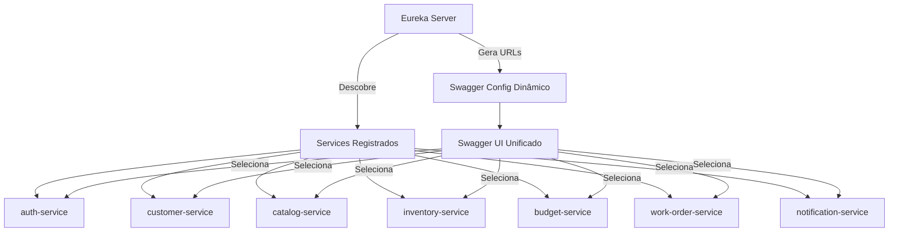

# Swagger Unificado - Documentação Agregada

## Visão Geral

Todos os microservices da Oficina possuem suas próprias documentações OpenAPI/Swagger. Para facilitar o uso, implementamos um **Swagger Agregador** no Eureka Server que unifica todas as documentações em uma única interface.

## Como Funciona



### Fluxo

1. **Eureka Server** descobre automaticamente todos os services registrados
2. Para cada service, obtém sua URL base (via service discovery)
3. Gera dinamicamente a configuração do Swagger UI com todas as URLs
4. Swagger UI mostra um **dropdown** com todos os services disponíveis
5. Usuário seleciona o service desejado e vê sua documentação

## Vantagens

✅ **Totalmente dinâmico** - Não precisa configurar URLs manualmente
✅ **Auto-descoberta** - Novos services aparecem automaticamente
✅ **Funciona em todos os ambientes** - Local, Docker, Kubernetes
✅ **Sem hardcoded URLs** - Usa service discovery do Eureka
✅ **Interface única** - Um único Swagger UI para todos os services
✅ **Fácil de usar** - Dropdown para selecionar o service

## Componentes Implementados

### 1. SwaggerConfig.java

Configuração principal que:
- Detecta services registrados no Eureka
- Obtém URLs base de cada service
- Formata nomes para exibição

**Localização:** `eureka-server/src/main/java/br/com/fiap/oficina/eureka/config/SwaggerConfig.java`

### 2. SwaggerAggregatorController.java

Controller REST com 3 endpoints:

#### GET /v3/api-docs/swagger-config
Retorna configuração do Swagger UI (usado internamente)

```json
{
  "urls": [
    {
      "name": "Auth Service",
      "url": "http://auth-service:8082/v3/api-docs"
    },
    {
      "name": "Customer Service",
      "url": "http://customer-service:8081/v3/api-docs"
    }
    // ...
  ],
  "displayRequestDuration": true,
  "filter": true,
  "tryItOutEnabled": true
}
```

#### GET /swagger/services
Lista todos os services e suas URLs

```json
{
  "totalServices": 7,
  "services": [
    {
      "name": "auth-service",
      "displayName": "Auth Service",
      "baseUrl": "http://auth-service:8082/",
      "apiDocsUrl": "http://auth-service:8082/v3/api-docs",
      "swaggerUiUrl": "http://auth-service:8082/swagger-ui.html"
    }
    // ...
  ],
  "aggregatedSwaggerUrl": "/swagger-ui.html"
}
```

#### GET /swagger/health
Health check do agregador

```json
{
  "status": "UP",
  "servicesDiscovered": 7,
  "services": [
    "auth-service",
    "budget-service",
    "catalog-service",
    "customer-service",
    "inventory-service",
    "notification-service",
    "work-order-service"
  ]
}
```

**Localização:** `eureka-server/src/main/java/br/com/fiap/oficina/eureka/controller/SwaggerAggregatorController.java`

### 3. application.yml (atualizado)

Configuração simplificada e dinâmica:

```yaml
springdoc:
  swagger-ui:
    path: /swagger-ui.html
    config-url: /v3/api-docs/swagger-config  # Usa o endpoint dinâmico
    urls-primary-name: Auth Service
    display-request-duration: true
    filter: true
  api-docs:
    path: /v3/api-docs
  show-actuator: false
```

## Como Acessar

### Local Development

1. Inicie o Eureka Server:
```bash
cd eureka-server
mvn spring-boot:run
```

2. Inicie os microservices (em terminais separados):
```bash
cd auth-service && mvn spring-boot:run
cd customer-service && mvn spring-boot:run
cd catalog-service && mvn spring-boot:run
# ... outros services
```

3. Acesse o Swagger Unificado:
```
http://localhost:8761/swagger-ui.html
```

### Docker Compose

```bash
docker compose --profile dev up -d
```

Acesse: `http://localhost:8761/swagger-ui.html`

### Kubernetes (Minikube)

```bash
kubectl apply -k k8s/overlays/local
kubectl -n oficina port-forward svc/eureka-server-internal 8761:8761
```

Acesse: `http://localhost:8761/swagger-ui.html`

### AWS EKS (Dev)

Via API Gateway:
```
https://d6l9d5prg2.execute-api.us-east-2.amazonaws.com/eureka/swagger-ui.html
```

Ou via NLB do Eureka (se configurado como público).

## Como Usar

### 1. Abra a Interface

Acesse `http://localhost:8761/swagger-ui.html` (ou a URL apropriada para seu ambiente)

### 2. Selecione o Microservice

No topo da página, você verá um **dropdown "Select a definition"** com todos os services:

```
Select a definition:
  ▼ Auth Service
    Customer Service
    Catalog Service
    Inventory Service
    Budget Service
    Work Order Service
    Notification Service
```

### 3. Explore a API

Selecione um service e veja:
- 📋 Todos os endpoints disponíveis
- 📝 Modelos de request/response
- ✅ Schemas de validação
- 🧪 Ferramenta "Try it out" para testar

### 4. Testar Endpoints

1. Clique em um endpoint (ex: `POST /api/auth/login`)
2. Clique em "Try it out"
3. Preencha o body JSON
4. Clique em "Execute"
5. Veja a resposta

## Endpoints de Utilidade

### Verificar Services Descobertos

```bash
curl http://localhost:8761/swagger/services | jq '.'
```

### Health Check do Agregador

```bash
curl http://localhost:8761/swagger/health | jq '.'
```

### Configuração Atual do Swagger

```bash
curl http://localhost:8761/v3/api-docs/swagger-config | jq '.'
```

## Troubleshooting

### Problema: Nenhum service aparece no dropdown

**Causas possíveis:**
1. Services não estão registrados no Eureka
2. Eureka Server não iniciou completamente
3. Services não expõem `/v3/api-docs`

**Solução:**
```bash
# Verificar services registrados no Eureka
curl http://localhost:8761/eureka/apps | grep '<app>'

# Verificar health do agregador
curl http://localhost:8761/swagger/health

# Verificar se service expõe api-docs
curl http://localhost:8082/v3/api-docs
```

### Problema: Erro 404 ao selecionar um service

**Causa:** Service não tem SpringDoc configurado

**Solução:** Verificar se o service tem a dependência:
```xml
<dependency>
    <groupId>org.springdoc</groupId>
    <artifactId>springdoc-openapi-starter-webmvc-ui</artifactId>
</dependency>
```

### Problema: URLs com localhost em vez de service names

**Causa:** Ambiente local sem service discovery funcional

**Solução:**
- Em Docker: Usar `docker-compose` com profile dev
- Em K8s: Services se comunicam via DNS interno
- Verificar configuração de `eureka.instance.hostname`

### Problema: CORS errors ao testar endpoints

**Causa:** CORS não configurado no microservice

**Solução:** Verificar `CorsConfig` na `shared-library`

## Swagger Individual de Cada Service

Se preferir acessar o Swagger de um service específico:

| Service | URL Local | URL EKS |
|---------|-----------|---------|
| Auth | http://localhost:8082/swagger-ui.html | .../auth/swagger-ui.html |
| Customer | http://localhost:8081/swagger-ui.html | .../customer/swagger-ui.html |
| Catalog | http://localhost:8083/swagger-ui.html | .../catalog/swagger-ui.html |
| Inventory | http://localhost:8084/swagger-ui.html | .../inventory/swagger-ui.html |
| Budget | http://localhost:8085/swagger-ui.html | .../budget/swagger-ui.html |
| Work Order | http://localhost:8086/swagger-ui.html | .../work-order/swagger-ui.html |

## Adicionando um Novo Microservice

Para adicionar um novo service à documentação agregada:

### 1. Adicionar SpringDoc ao POM

```xml
<dependency>
    <groupId>org.springdoc</groupId>
    <artifactId>springdoc-openapi-starter-webmvc-ui</artifactId>
</dependency>
```

### 2. Configurar application.yml

```yaml
springdoc:
  swagger-ui:
    path: /swagger-ui.html
  api-docs:
    path: /v3/api-docs
```

### 3. Registrar no Eureka

```yaml
eureka:
  client:
    service-url:
      defaultZone: ${EUREKA_URL:http://localhost:8761/eureka/}
```

### 4. Reiniciar o Service

O Eureka Server detectará automaticamente e o service aparecerá no dropdown!

## Documentando seus Endpoints

Use anotações do SpringDoc/OpenAPI:

```java
@RestController
@RequestMapping("/api/clientes")
@Tag(name = "Clientes", description = "Gerenciamento de clientes")
public class ClienteController {

    @Operation(summary = "Criar novo cliente", description = "Cria um novo cliente no sistema")
    @ApiResponses(value = {
        @ApiResponse(responseCode = "201", description = "Cliente criado com sucesso"),
        @ApiResponse(responseCode = "400", description = "Dados inválidos"),
        @ApiResponse(responseCode = "401", description = "Não autorizado")
    })
    @PostMapping
    public ResponseEntity<ClienteResponseDTO> criar(
            @Parameter(description = "Dados do cliente") @RequestBody ClienteRequestDTO request) {
        // ...
    }
}
```

## Recursos Adicionais

- [SpringDoc OpenAPI Documentation](https://springdoc.org/)
- [Swagger UI Documentation](https://swagger.io/tools/swagger-ui/)
- [OpenAPI Specification](https://swagger.io/specification/)
- [Spring Cloud Netflix Eureka](https://spring.io/projects/spring-cloud-netflix)

## Exemplo de Uso Completo

```bash
# 1. Iniciar ambiente
docker compose --profile dev up -d

# 2. Aguardar services registrarem
sleep 30

# 3. Verificar services descobertos
curl http://localhost:8761/swagger/services | jq '.services[] | {name, displayName}'

# 4. Abrir Swagger UI no browser
open http://localhost:8761/swagger-ui.html

# 5. No browser:
#    - Selecionar "Auth Service" no dropdown
#    - Expandir POST /api/auth/login
#    - Clicar "Try it out"
#    - Preencher:
#      {
#        "username": "admin",
#        "password": "admin123"
#      }
#    - Clicar "Execute"
#    - Copiar o token da resposta

# 6. Testar outro endpoint com o token:
#    - Selecionar "Customer Service" no dropdown
#    - Expandir GET /api/clientes
#    - Clicar "Try it out"
#    - Clicar no cadeado 🔒 e colar o token
#    - Clicar "Execute"
```

## Melhorias Futuras

### Autenticação no Swagger UI

Adicionar autenticação JWT diretamente no Swagger UI:

```java
@Bean
public OpenAPI customOpenAPI() {
    return new OpenAPI()
        .components(new Components()
            .addSecuritySchemes("bearer-jwt",
                new SecurityScheme()
                    .type(SecurityScheme.Type.HTTP)
                    .scheme("bearer")
                    .bearerFormat("JWT")
                    .in(SecurityScheme.In.HEADER)
                    .name("Authorization")))
        .addSecurityItem(new SecurityRequirement().addList("bearer-jwt"));
}
```

### Agrupamento por Domínio

Agrupar services por domínio de negócio:

```
📁 Autenticação
  - Auth Service

📁 Clientes
  - Customer Service

📁 Oficina
  - Catalog Service
  - Inventory Service
  - Budget Service
  - Work Order Service

📁 Notificações
  - Notification Service
```

### Versionamento de API

Suportar múltiplas versões da mesma API:

```
- Auth Service v1
- Auth Service v2 (beta)
```

### Cache de API Docs

Cachear os API docs dos services para melhor performance.
