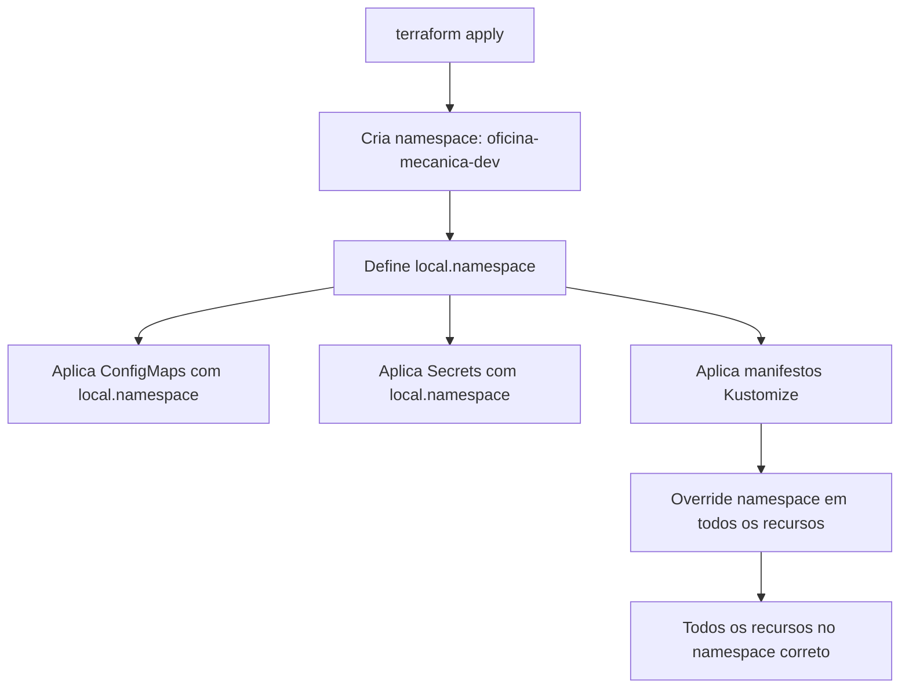

# Gerenciamento de Namespace no Terraform

Este documento explica como o namespace do Kubernetes é gerenciado na infraestrutura.

## 🏗️ Estrutura Centralizada

O namespace é **criado e gerenciado exclusivamente pelo Terraform**, não pelos manifestos Kustomize.

### Arquivo de Definição

**Arquivo**: [namespace.tf](./namespace.tf)

```terraform
resource "kubernetes_namespace" "oficina" {
  metadata {
    name = "oficina-mecanica-${local.environment}"
    labels = {
      name        = "oficina-${local.environment}"
      environment = local.environment
    }
  }
}
```

### Referência Centralizada

**Arquivo**: [locals.tf](./locals.tf#L8)

```terraform
locals {
  # ... outras variáveis
  
  # Namespace centralizado - usado por todos os recursos
  namespace = kubernetes_namespace.oficina.metadata[0].name
}
```

## 📋 Uso em Recursos

Todos os recursos K8s no Terraform referenciam `local.namespace`:

### 1. ConfigMaps e Secrets

```terraform
resource "kubernetes_config_map_v1_data" "db_override" {
  metadata {
    name      = "oficina-shared-config"
    namespace = local.namespace  # ✅ Referência centralizada
  }
  # ...
}
```

### 2. Manifestos Kubectl

```terraform
resource "kubectl_manifest" "kustomization" {
  for_each = data.kubectl_file_documents.kustomization.manifests
  
  yaml_body = replace(
    each.value,
    "namespace: oficina-mecanica-${terraform.workspace}",
    "namespace: ${local.namespace}"  # ✅ Override para namespace correto
  )
  
  override_namespace = local.namespace  # ✅ Força todos os recursos
  depends_on = [kubernetes_namespace.oficina]
}
```

## 🎯 Namespaces por Ambiente

| Ambiente | Namespace | Criado por |
|----------|-----------|------------|
| **Local** (Minikube) | `oficina` | Kustomize |
| **Dev** (EKS) | `oficina-mecanica-dev` | Terraform |
| **Prod** (EKS) | `oficina-mecanica-prod` | Terraform |

## 📝 Kustomize - Manifesto Removido

Os arquivos `namespace.yaml` foram **removidos** dos overlays dev/prod:

### ❌ Antes
```yaml
# k8s/overlays/dev/kustomization.yaml
resources:
  - namespace.yaml  # ❌ Conflitava com Terraform
  - secrets.yaml
  - ingress.yaml
```

### ✅ Depois
```yaml
# k8s/overlays/dev/kustomization.yaml
resources:
  # namespace.yaml removido - gerenciado pelo Terraform
  - secrets.yaml
  - ingress.yaml
```

## 🔄 Fluxo de Criação



## 🚨 Importante

1. **Nunca referencie diretamente** `kubernetes_namespace.oficina.metadata[0].name`
2. **Sempre use** `local.namespace`
3. **Não commite** `namespace.yaml` nos overlays dev/prod
4. **Ambiente local (Minikube)** continua usando Kustomize puro (com namespace.yaml)

## 🔍 Verificar Namespace Ativo

```bash
# Via Terraform
cd infra
terraform output

# Via kubectl
kubectl get namespaces
kubectl get all -n oficina-mecanica-dev
```

## 🛠️ Adicionar Novo Recurso

Ao adicionar novos recursos Kubernetes no Terraform:

```terraform
resource "kubernetes_<tipo>" "meu_recurso" {
  metadata {
    name      = "nome-do-recurso"
    namespace = local.namespace  # ✅ Use local.namespace
  }
  # ...
}
```

## 📚 Arquivos Relacionados

- [namespace.tf](./namespace.tf) - Definição do namespace
- [locals.tf](./locals.tf) - Variável local.namespace
- [configmap.tf](./configmap.tf) - ConfigMaps e Secrets usando local.namespace
- [k8s.tf](./k8s.tf) - Override de namespace nos manifestos
- [datadog.tf](./datadog.tf) - Datadog (namespace próprio: datadog-agent)
